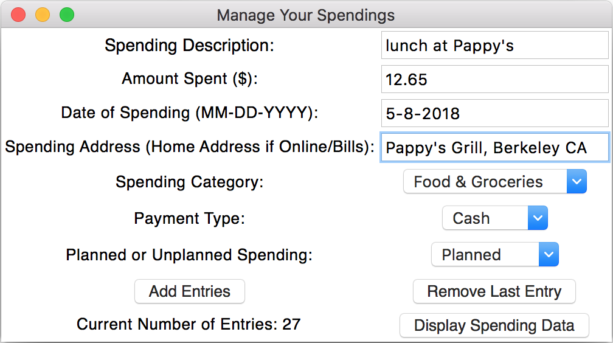
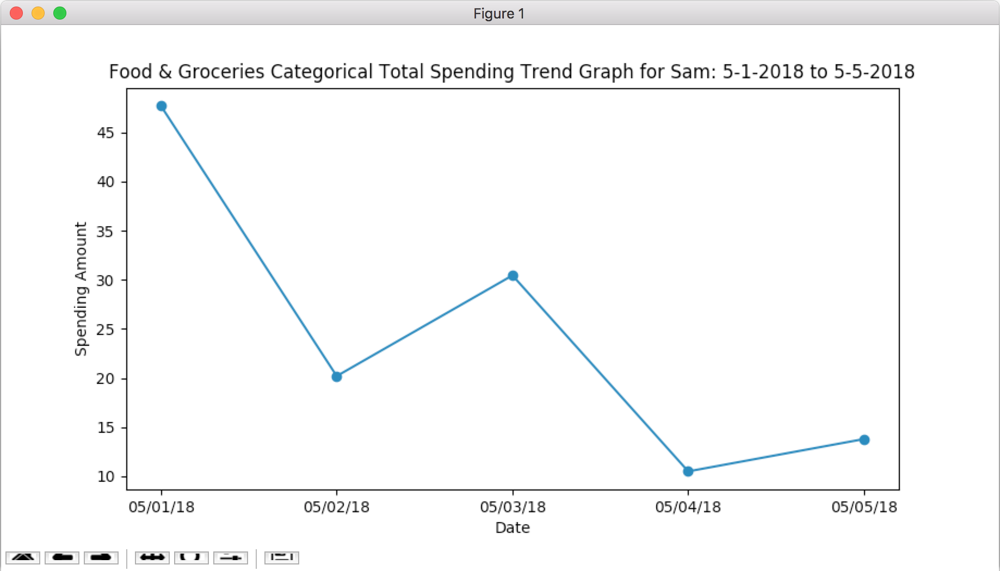
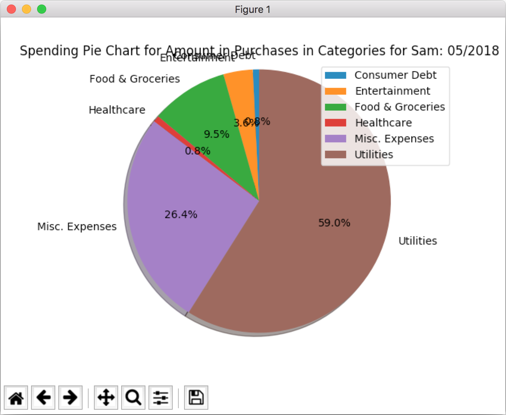
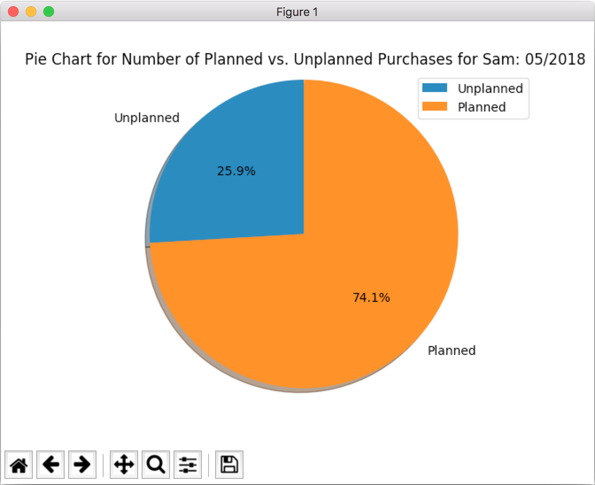

# Dollars: GUI Walkthrough

This page will give you a brief overview of how Dollars works, and examples of its GUI.

**Main Page**

This is the main page of Dollars, with 5 main features outside of user creation and management: logging/managing your spending data; visualizing your spending data in various ways; predicting future spendings and budgeting using ARIMA forecasting; managing your budget for the current month; and viewing a spending profile detailing your spending habits.  

 

A simple string dialog window asking for a new username. Will fail if the username already exists.   

 

List of users when a user has not been selected yet (i.e. first time the applet is opened).

 

List of users when a user has been selected.

 

A simple string dialog window asking for the username to delete. Leads to a confirmation window, and if yes deletes the file branch within data/users that contains all of the selected-to-delete user's data.

**Spending Data Management**

The spending data management page, where the user logs, views, and deletes their spending data. Every entry is required, and cannot be left blank (will also throw an error if the wrong kind of entry is put in, e.g. string in 'Amount'). The data are internally stored in a ``pandas`` data frame, and written/read from a .gz file locally.

 

A ``pandastable`` window that opens when "Display Spending Data" is clicked. Displays all the data logged by the current user.

**Spending Data Visualizations**

The spending data visualization page. The user has the option to view 7 different data visualizations: a general 
spending trend graph (filtered by month); a spending category trend graph (filtered by category and current month); a pie chart for number of spendings in each category; a pie chart for amount of money spent in each category; a pie chart for number of planned vs. unplanned purchases; a frequency plot for different payment types; and a heat map for concentrations of spendings, filtered by city. The first 6 of these visualizations use ``matplotlib``, while the heat map uses ``gmplot``. The following are samples of these visualizations:

 

An overall spending trend graph.

 

A spending trend graph by category.

 

A pie chart of number of spendings per category.

 

A pie chart of amount of money spent per category.

 

A pie chart of number of planned vs. unplanned purchases.

 

A frequency bar plot for different payment types.

 

A heat map of spending concentrations by city.

**Spending Predictions**

A spending data prediction page using ARIMA forecasting. Due to the extremely various nature of different people's spending types, it's almost impossible to have one set ``p, d, q`` parameters for any ARIMA model. So, this page utilizes ``pyramid-arima``'s ``auto_arima()`` feature to find the most suitable parameters for the current spending dataset. There are currently 3 planned prediction features, with 2 of them implemented: an overall prediction for daily spending forecasts for the remaining days of the current month (soon to be locked to max. of 15 days); a categorical prediction for daily spending forecasts (not yet implemented); and a budget prediction feature that estimates whether or not the current user will be overbudget (see budget prediction page). The forecast numbers need some tuning, and the ``auto_arima()`` function may also need some tuning in its parameters for greater accuracy. The following 2 images are samples of overall predictions and budget predictions.

 

ARIMA forecasting of daily spendings for the remainder of May 2018. Results may be overfitted and require tuning.

 

Using the data from overall predictions, this budget prediction feature estimates whether or not the current user will be over or underbudget by the end of the month.

**Budget Management**

A budget management page. This page displays the user's current budget (that they set at the beginning of each month), and stores all previous budgets in a ``pandas`` data frame. The current budget month, year, and amount are stored internally in a list, and the user can freely change their budget. This page also displays the amount of money they have left in their budget, and also gives the option to display their cumulative spending for the current month vs. their set budget. The user can also choose to display a trend graph of all their previous months' budgets.

 

A cumulative spending vs. budget trend graph.

 

A trend graph of all the user's monthly budgets.

**Spending Profile**

A spending profile page. This page shows a summarizes a user's spending data, and displays a brief overview of the user's spending habits. Some of the labels include most and least expensive purchases, most/least spent categories, and cities with the most/least amount of money spent.
